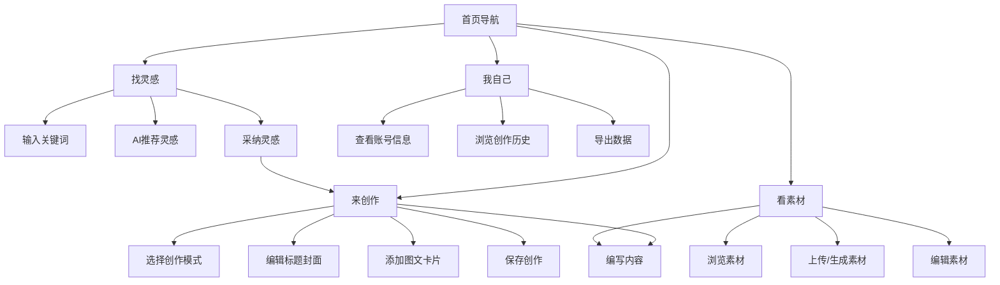

# Zevi的小红书图文内容生成工具 - 产品需求文档

## 1. Product Overview
Zevi的小红书图文内容生成工具是一款专为个人创作者设计的PC端内容创作助手。通过AI智能推荐和集成化创作面板，帮助用户快速生成高质量的小红书图文内容。

主要解决创作灵感匮乏、内容创作效率低、素材管理混乱等问题。面向个人用户，提供从灵感收集到内容创作再到素材管理的一站式解决方案。

## 2. Core Features

### 2.1 User Roles
由于是为个人使用设计，仅有一个用户角色：

| Role | Registration Method | Core Permissions |
|------|---------------------|------------------|
| Personal User | 本地使用，无需注册 | 所有功能完全访问 |

### 2.2 Feature Module
本工具包含以下核心页面：
1. **找灵感页面**：关键词输入、AI灵感推荐、灵感记录管理
2. **来创作页面**：内容编辑器、AI生成工具、素材选择、标签管理
3. **看素材页面**：素材库管理、图片上传、文本编辑、分类查看
4. **我自己页面**：个人账号信息展示、创作历史记录、数据统计

### 2.3 Page Details

| Page Name | Module Name | Feature description |
|-----------|-------------|---------------------|
| 找灵感页面 | 关键词输入区 | 输入创作关键词，支持多个关键词组合，实时搜索建议 |
| 找灵感页面 | AI灵感推荐 | 基于关键词调用大模型API生成5-8个创作灵感，显示灵感标题和简短描述 |
| 找灵感页面 | 灵感记录列表 | 展示历史搜索记录和对应灵感，支持按时间排序和关键词筛选 |
| 找灵感页面 | 灵感采纳操作 | 点击采纳按钮标记灵感为已采纳状态，可跳转到来创作页面 |
| 来创作页面 | 创作模式选择 | 选择基于灵感创作或从头开始创作，显示相关灵感信息 |
| 来创作页面 | 图文标题编辑 | 输入和编辑标题，支持AI优化建议，实时字数统计 |
| 来创作页面 | 封面图生成 | 上传图片或AI生成封面图，支持图片裁剪和滤镜调整 |
| 来创作页面 | 富文本编辑器 | 支持加粗、斜体、列表、emoji等格式，AI辅助写作 |
| 来创作页面 | 话题标签管理 | 添加和编辑话题标签，支持热门话题推荐和自定义标签 |
| 来创作页面 | 图文卡片管理 | 添加多个图文卡片，每张卡片包含图片和描述文字 |
| 来创作页面 | 内容预览 | 实时预览小红书格式效果，支持全屏预览模式 |
| 来创作页面 | 标签分类 | 为创作内容添加自定义标签，支持标签管理和快速选择 |
| 看素材页面 | 素材分类展示 | 按图片和文本分类展示所有素材，支持网格和列表视图 |
| 看素材页面 | 图片素材管理 | 上传本地图片、AI生成图片、删除图片、图片预览 |
| 看素材页面 | 文本素材管理 | 手动编辑文本、AI生成文本、文本分类、快速复制 |
| 看素材页面 | 素材搜索筛选 | 按关键词搜索素材，按时间、类型、标签筛选 |
| 看素材页面 | 素材使用统计 | 显示素材被使用的次数和最近使用时间 |
| 我自己页面 | 账号信息展示 | 显示头像、昵称、个性签名、IP地址解析、账号类型 |
| 我自己页面 | 创作统计 | 展示总创作数量、采纳灵感数量、最常使用的标签 |
| 我自己页面 | 创作历史记录 | 按时间倒序展示所有创作内容，支持搜索和筛选 |
| 我自己页面 | 数据导出 | 支持导出创作记录和素材库数据为JSON格式 |

## 3. Core Process

### 主要用户操作流程：

1. **灵感发现流程**：
   - 进入找灵感页面 → 输入关键词 → 查看AI推荐灵感 → 选择采纳灵感 → 跳转创作页面

2. **内容创作流程**：
   - 选择创作模式 → 编辑标题 → 生成/上传封面 → 编写正文内容 → 添加话题标签 → 创建图文卡片 → 预览效果 → 保存创作

3. **素材管理流程**：
   - 进入看素材页面 → 浏览/搜索素材 → 上传新素材或生成素材 → 编辑素材信息 → 在创作中使用素材

4. **个人中心流程**：
   - 查看个人账号信息 → 浏览创作历史 → 分析创作数据 → 导出备份数据

## 4. User Interface Design

### 4.1 Design Style
- **主色调**：小红书风格，以红色(#FF2442)为主色调，搭配白色背景和灰色辅助色
- **按钮样式**：圆角矩形设计，主要操作按钮使用红色，次要按钮使用灰色
- **字体选择**：主要使用PingFang SC，标题16-18px，正文14px，辅助文字12px
- **布局风格**：左侧导航栏 + 右侧内容区的经典桌面应用布局
- **图标风格**：使用简洁的线性图标，主要操作配emoji表情增强交互感

### 4.2 Page Design Overview

| Page Name | Module Name | UI Elements |
|-----------|-------------|-------------|
| 找灵感页面 | 搜索区域 | 顶部搜索框，红色边框，占位符文字"输入关键词，激发创作灵感..."，右侧红色搜索按钮带🔍图标 |
| 找灵感页面 | 灵感卡片 | 白色卡片布局，阴影效果，包含灵感标题(16px加粗)、描述文字(14px灰色)、采纳按钮(红色圆角) |
| 来创作页面 | 编辑器头部 | 顶部工具栏，包含保存、预览、AI辅助按钮，标题输入框大字体(18px)设计 |
| 来创作页面 | 富文本编辑区 | 白色编辑区域，最小高度300px，支持markdown快捷输入，工具栏悬浮设计 |
| 来创作页面 | 图文卡片区 | 网格布局展示卡片，每张卡片有图片预览区和文字输入区，支持拖拽排序 |
| 看素材页面 | 素材网格 | 响应式网格布局，图片卡片显示缩略图，文本卡片显示内容预览，hover效果增强 |
| 看素材页面 | 上传区域 | 拖拽上传区域设计，支持点击上传，显示上传进度和预览 |
| 我自己页面 | 个人信息卡片 | 圆形头像设计，大字体昵称，个性签名斜体显示，信息分组卡片布局 |

### 4.3 Responsiveness
- **桌面端优先**：主要针对1920x1080及以上分辨率优化
- **响应式适配**：支持1366x768及以上分辨率，确保在小屏笔记本上也能正常使用
- **触控优化**：按钮和交互元素适当增大，支持触控板手势操作

## 5. Technical Requirements

### 5.1 AI集成要求
- 支持调用国外大模型API（如GPT-4、Claude等）
- 灵感生成prompt需要针对小红书内容特点优化
- 支持自定义AI生成参数（温度、长度等）
- 提供AI生成内容的编辑和优化功能

### 5.2 数据存储要求
- 本地数据库存储所有创作内容和素材
- 支持数据导出和备份功能
- 提供数据压缩和清理机制
- 确保数据安全和隐私保护

### 5.3 性能要求
- 页面加载时间不超过2秒
- AI生成响应时间控制在5-10秒内
- 支持离线查看已创作内容
- 图片处理支持常见格式（JPG、PNG、GIF等）