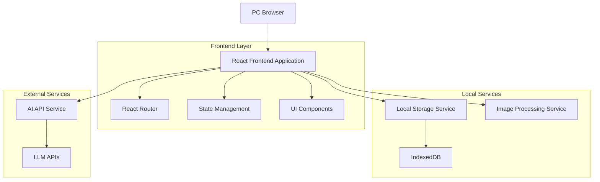
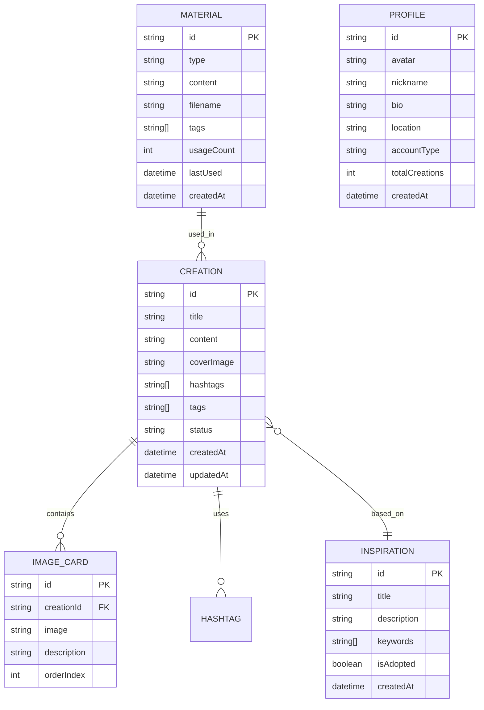

# Zevi的小红书图文内容生成工具 - 技术架构文档

## 1. Architecture design



## 2. Technology Description

### 核心技术栈
- **Frontend**: React@18 + TypeScript@5 + Vite@5
- **UI Framework**: TailwindCSS@3 + HeadlessUI
- **State Management**: Zustand@4
- **Rich Text Editor**: TipTap@2
- **Image Processing**: Canvas API + Sharp.js
- **Database**: IndexedDB (浏览器本地数据库)
- **AI Integration**: OpenAI API / Claude API
- **Initialization Tool**: vite-init

### 关键依赖包
```json
{
  "dependencies": {
    "react": "^18.2.0",
    "react-dom": "^18.2.0",
    "zustand": "^4.4.0",
    "@tiptap/react": "^2.1.0",
    "@tiptap/starter-kit": "^2.1.0",
    "tailwindcss": "^3.3.0",
    "lucide-react": "^0.263.0",
    "dexie": "^3.2.0",
    "openai": "^4.0.0",
    "axios": "^1.5.0",
    "react-router-dom": "^6.15.0",
    "react-dropzone": "^14.2.0",
    "html2canvas": "^1.4.0"
  }
}
```

## 3. Route definitions

| Route | Purpose | Component |
|-------|---------|-----------|
| / | 首页导航 | HomePage |
| /inspiration | 找灵感页面 | InspirationPage |
| /create | 来创作页面 | CreatePage |
| /create/:id | 编辑指定创作 | EditPage |
| /materials | 看素材页面 | MaterialsPage |
| /profile | 我自己页面 | ProfilePage |
| /settings | 设置页面 | SettingsPage |

## 4. API definitions

### 4.1 AI Service APIs

**Generate Inspiration**
```
POST /api/ai/generate-inspiration
```

Request:
```typescript
interface GenerateInspirationRequest {
  keywords: string[];
  count?: number; // 默认5个
  language?: 'zh' | 'en';
}
```

Response:
```typescript
interface GenerateInspirationResponse {
  inspirations: {
    id: string;
    title: string;
    description: string;
    keywords: string[];
    createdAt: string;
  }[];
}
```

**Generate Content**
```
POST /api/ai/generate-content
```

Request:
```typescript
interface GenerateContentRequest {
  type: 'title' | 'description' | 'hashtags';
  context: {
    inspiration?: string;
    keywords?: string[];
    tone?: 'casual' | 'professional' | 'trendy';
  };
}
```

**Generate Image**
```
POST /api/ai/generate-image
```

Request:
```typescript
interface GenerateImageRequest {
  prompt: string;
  size?: '1024x1024' | '512x512';
  style?: 'realistic' | 'cartoon' | 'minimal';
}
```

### 4.2 Data Management APIs

**Save Creation**
```
POST /api/creations
```

Request:
```typescript
interface SaveCreationRequest {
  title: string;
  coverImage?: string;
  content: string;
  hashtags: string[];
  imageCards: {
    image: string;
    description: string;
  }[];
  inspirationId?: string;
  tags: string[];
}
```

**Get Materials**
```
GET /api/materials?type=image|text&page=1&limit=20
```

## 5. Data model

### 5.1 Data model definition



### 5.2 Data Definition Language

**Creation Table (creations)**
```sql
-- IndexedDB schema using Dexie.js
interface Creation {
  id: string;                    // UUID
  title: string;                 // 创作标题
  content: string;               // 正文内容
  coverImage?: string;          // 封面图片(base64或URL)
  hashtags: string[];            // 话题标签数组
  imageCards: ImageCard[];      // 图文卡片数组
  tags: string[];               // 自定义标签
  inspirationId?: string;       // 关联的灵感ID
  status: 'draft' | 'published' | 'archived';
  createdAt: Date;
  updatedAt: Date;
}

interface ImageCard {
  id: string;
  image: string;                // 图片(base64或URL)
  description: string;           // 图片描述
  orderIndex: number;           // 排序索引
}
```

**Inspiration Table (inspirations)**
```sql
interface Inspiration {
  id: string;
  title: string;                // 灵感标题
  description: string;          // 灵感描述
  keywords: string[];           // 关键词数组
  isAdopted: boolean;           // 是否被采纳
  createdAt: Date;
}
```

**Material Table (materials)**
```sql
interface Material {
  id: string;
  type: 'image' | 'text';      // 素材类型
  content: string;              // 内容(图片为base64，文本为字符串)
  filename?: string;            // 文件名
  tags: string[];               // 标签数组
  usageCount: number;           // 使用次数
  lastUsed?: Date;              // 最后使用时间
  createdAt: Date;
  metadata?: {                   // 额外元数据
    size?: number;               // 文件大小
    dimensions?: {width: number; height: number}; // 图片尺寸
    wordCount?: number;          // 文本字数
  };
}
```

**Profile Table (profile)**
```sql
interface Profile {
  id: string;
  avatar?: string;               // 头像(base64或URL)
  nickname: string;              // 昵称
  bio?: string;                 // 个性签名
  location?: string;             // 地理位置
  accountType: string;           // 账号类型
  totalCreations: number;        // 总创作数
  createdAt: Date;
  settings?: {                   // 用户设置
    defaultTone: string;          // 默认写作风格
    aiPreferences: object;      // AI偏好设置
    theme: 'light' | 'dark';    // 主题设置
  };
}
```

## 6. Component Architecture

### 6.1 Core Components Structure

```
src/
├── components/
│   ├── common/
│   │   ├── Header.tsx
│   │   ├── Sidebar.tsx
│   │   ├── Loading.tsx
│   │   └── ErrorBoundary.tsx
│   ├── inspiration/
│   │   ├── KeywordInput.tsx
│   │   ├── InspirationCard.tsx
│   │   ├── InspirationList.tsx
│   │   └── InspirationGenerator.tsx
│   ├── create/
│   │   ├── TitleEditor.tsx
│   │   ├── CoverUploader.tsx
│   │   ├── RichTextEditor.tsx
│   │   ├── ImageCardEditor.tsx
│   │   ├── HashtagManager.tsx
│   │   └── CreationPreview.tsx
│   ├── materials/
│   │   ├── MaterialGrid.tsx
│   │   ├── MaterialUploader.tsx
│   │   ├── MaterialEditor.tsx
│   │   └── MaterialFilters.tsx
│   └── profile/
│       ├── ProfileCard.tsx
│       ├── CreationStats.tsx
│       └── CreationHistory.tsx
├── pages/
│   ├── HomePage.tsx
│   ├── InspirationPage.tsx
│   ├── CreatePage.tsx
│   ├── MaterialsPage.tsx
│   └── ProfilePage.tsx
├── services/
│   ├── aiService.ts
│   ├── storageService.ts
│   ├── imageService.ts
│   └── exportService.ts
├── stores/
│   ├── useCreationStore.ts
│   ├── useInspirationStore.ts
│   ├── useMaterialStore.ts
│   └── useProfileStore.ts
└── utils/
    ├── constants.ts
    ├── helpers.ts
    └── types.ts
```

### 6.2 State Management

使用Zustand进行状态管理，分为以下store：

**Creation Store**
```typescript
interface CreationState {
  currentCreation: Creation | null;
  isEditing: boolean;
  saveCreation: (creation: Creation) => Promise<void>;
  loadCreation: (id: string) => Promise<void>;
  updateCreation: (updates: Partial<Creation>) => void;
}
```

**Inspiration Store**
```typescript
interface InspirationState {
  inspirations: Inspiration[];
  isGenerating: boolean;
  generateInspirations: (keywords: string[]) => Promise<void>;
  adoptInspiration: (id: string) => void;
}
```

## 7. Performance Optimization

### 7.1 图片处理优化
- 图片上传时自动压缩和格式转换
- 使用WebP格式减少文件大小
- 实现图片懒加载和预加载策略
- 使用Canvas进行客户端图片处理

### 7.2 AI请求优化
- 实现请求队列和重试机制
- 使用debounce减少频繁请求
- 缓存AI响应结果
- 实现离线模式支持

### 7.3 数据存储优化
- 使用IndexedDB进行大数据存储
- 实现数据分页和懒加载
- 定期数据压缩和清理
- 支持数据导出和导入

## 8. Security Considerations

### 8.1 API安全
- AI API密钥客户端加密存储
- 实现请求签名验证
- 限制请求频率和并发数
- 敏感数据脱敏处理

### 8.2 数据安全
- 本地数据加密存储
- 实现数据备份机制
- 防止XSS和CSRF攻击
- 用户隐私数据保护

## 9. Development Guidelines

### 9.1 代码规范
- 使用TypeScript严格模式
- 遵循React Hooks最佳实践
- 实现完整的错误边界处理
- 编写单元测试和集成测试

### 9.2 部署建议
- 使用Electron打包为桌面应用
- 支持自动更新机制
- 实现崩溃报告和日志收集
- 提供离线安装包