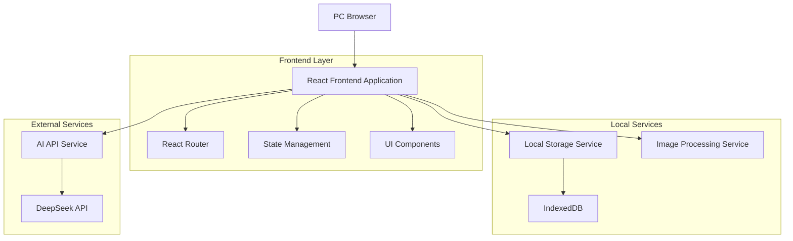
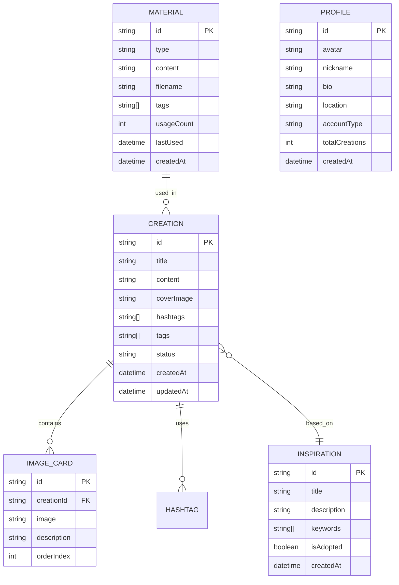

# Zevi的小红书图文内容生成工具 - 技术架构文档

## 1. Architecture design



## 2. Technology Description

### 核心技术栈
- **Frontend**: React@18 + TypeScript@5 + Vite@5
- **UI Framework**: TailwindCSS@3 + HeadlessUI
- **State Management**: Zustand@4
- **Rich Text Editor**: TipTap@2
- **Image Processing**: html2canvas + Canvas API
- **Database**: IndexedDB (浏览器本地数据库)
- **AI Integration**: DeepSeek-V3 API (via HTTP)

### 关键依赖包
```json
{
  "dependencies": {
    "react": "^18.2.0",
    "react-dom": "^18.2.0",
    "zustand": "^4.4.0",
    "@tiptap/react": "^2.1.0",
    "@tiptap/starter-kit": "^2.1.0",
    "tailwindcss": "^3.3.0",
    "lucide-react": "^0.263.0",
    "dexie": "^3.2.0",
    "axios": "^1.5.0",
    "react-router-dom": "^6.15.0",
    "react-dropzone": "^14.2.0",
    "html2canvas": "^1.4.0"
  }
}
```

## 3. Route definitions

| Route | Purpose | Component |
|-------|---------|-----------|
| / | 首页导航 | HomePage |
| /inspiration | 找灵感页面 | InspirationPage |
| /create | 来创作页面 | CreatePage |
| /create/:id | 编辑指定创作 | CreatePage |
| /materials | 看素材页面 | MaterialsPage |
| /profile | 我自己页面 | ProfilePage |

## 4. API definitions

### 4.1 AI Service APIs (Client-side)

All AI features use the `POST /chat/completions` endpoint from DeepSeek API via a proxy (e.g., Vercel Rewrites or Vite Proxy).

**Generate Inspiration**
Prompt: "Generate X XiaoHongShu topics based on keywords..."
Response: JSON array of inspiration objects.

**Optimize Content (Title/Description)**
Prompt: "Optimize this title/text for XiaoHongShu style..."
Response: Optimized string.

**Generate Image Styling (Cover/Card)**
Prompt: "Design a minimalist cover/card style based on this text..."
Response: JSON object containing CSS styles (background, color, layout) and tags.

### 4.2 Data Management APIs (Internal)

**Save Creation**
```typescript
interface SaveCreationRequest {
  title: string;
  coverImage?: string;
  content: string;
  hashtags: string[];
  imageCards: {
    image: string;
    description: string;
  }[];
  inspirationId?: string;
  tags: string[];
}
```

**Get Materials**
Query IndexedDB for materials with filtering by type and tags.

## 5. Data model

### 5.1 Data model definition



## 6. Component Architecture

### 6.1 Core Components Structure

```
src/
├── components/
│   ├── common/
│   │   ├── Sidebar.tsx
│   │   ├── Layout.tsx
│   │   └── Modal.tsx
│   ├── inspiration/
│   │   ├── KeywordInput.tsx
│   │   └── InspirationCard.tsx
│   ├── create/
│   │   ├── TitleEditor.tsx
│   │   ├── CoverUploader.tsx
│   │   ├── RichTextEditor.tsx
│   │   ├── ImageCardEditor.tsx
│   │   ├── HashtagManager.tsx
│   │   └── CreationPreview.tsx
│   ├── materials/
│   │   ├── MaterialBrowser.tsx
│   │   ├── MaterialDetailModal.tsx
│   │   ├── MaterialGrid.tsx
│   │   ├── MaterialPicker.tsx
│   │   └── TextMaterialEditor.tsx
│   └── profile/
│       ├── ProfileCard.tsx
│       ├── CreationStats.tsx
│       └── CreationHistory.tsx
├── pages/
│   ├── HomePage.tsx
│   ├── InspirationPage.tsx
│   ├── CreatePage.tsx
│   ├── MaterialsPage.tsx
│   └── ProfilePage.tsx
├── services/
│   └── aiService.ts
├── stores/
│   ├── useCreationStore.ts
│   ├── useInspirationStore.ts
│   ├── useMaterialStore.ts
│   └── useProfileStore.ts
└── db/
    └── index.ts
```

### 6.2 State Management

使用Zustand进行状态管理，分为以下store：

**Creation Store**
```typescript
interface CreationState {
  // ... (Draft management, auto-save)
}
```

**Inspiration Store**
```typescript
interface InspirationState {
  inspirations: Inspiration[];
  isGenerating: boolean;
  generateInspirations: (keywords: string[]) => Promise<void>;
  adoptInspiration: (id: string) => void;
  // Added: clearInspirations
}
```

## 7. Performance Optimization

### 7.1 图片处理优化
- 使用 `html2canvas` 在客户端生成图片，避免服务端渲染开销。
- 图片存储为 Base64 字符串在 IndexedDB 中（注意：对于大量图片可能需要优化，如使用 Blob）。

### 7.2 AI请求优化
- 直接在前端调用 DeepSeek API（通过代理解决 CORS）。
- 错误处理和 Loading 状态管理。

### 7.3 数据存储优化
- 使用 IndexedDB 进行大数据存储。

## 8. Security Considerations

### 8.1 API安全
- `VITE_DEEPSEEK_API_KEY` 环境变量配置。
- **注意**：前端直接调用 API Key 存在暴露风险，生产环境建议通过后端代理转发（Vercel Functions 或自有后端）。

### 8.2 数据安全
- 本地数据存储，用户隐私可控。
